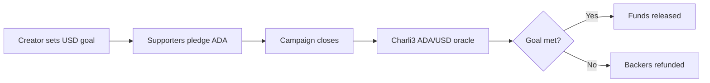

# TSUNAGI Funding

**Connecting People Through ADA Funding**

TSUNAGI Funding is an oracle-native crowdfunding prototype on Cardano.
Creators raise in ADA against a USD-denominated goal, and at campaign close
a live Charli3 ADA/USD oracle determines whether the campaign succeeded or
whether supporters are refunded.

## Why the oracle matters

Crowdfunding goals are naturally expressed in USD, but supporters pledge in
ADA. The ADA/USD exchange rate moves between the time a campaign launches
and when it closes. Without an oracle, there is no trustworthy way to
determine whether a campaign actually met its USD target.

The oracle is not decorative — it is the mechanism that decides whether funds
are released to the creator or returned to backers. TSUNAGI Funding reads
the Charli3 ADA/USD price feed directly from the Cardano chain via Kupo and
uses it as the settlement authority.

## Current status

This is a hackathon prototype. The core domain logic, settlement engine,
live oracle integration, and frontend are functional.

- **Live Charli3 ADA/USD oracle integration is working on preprod**
- `/api/oracle` returns live price data from the on-chain Charli3 feed
- The settlement flow uses live oracle data to determine campaign outcomes
- The frontend is demo-ready but still prototype-stage
- If the live feed is unavailable, the app falls back to mock data with an
  explicit reason shown in the UI

## Verified live oracle milestone

The live oracle path has been verified against real Charli3 preprod data:

| Field | Value |
|---|---|
| Status | `live` |
| Price | $0.256299 |
| Raw integer | 256299 |
| Precision | 1e6 (price = raw / 1,000,000) |
| Source | Charli3 ADA/USD preprod (ODV feed) |
| Datum format | Plutus CBOR, decoded from the real on-chain datum |

The datum structure (`Constr → Constr → Map`) is decoded from the actual
Charli3 ODV contract output, not simulated.

## Architecture at a glance



## Product flow

1. Creator sets a campaign with a USD-denominated funding goal
2. Supporters pledge ADA to the campaign
3. Campaign reaches its close date
4. The app fetches the current ADA/USD price from the Charli3 on-chain feed
5. `pledged_ada * ada_usd_price` is compared to `goal_usd`
6. If the goal is met, funds are released to the creator
7. If not, pledges are returned to backers

## Routes

| Route | Description |
|---|---|
| `/` | Homepage with campaign cards and product overview |
| `/campaigns/new` | Create a new campaign (demo mode) |
| `/campaigns/[id]` | Campaign detail with pledge panel and live oracle rate |
| `/campaigns/[id]/close` | Settlement page with oracle proof and outcome |
| `/demo/oracle-proof` | Interactive oracle demo with live fetch |
| `/api/oracle` | Oracle price API — returns live Charli3 data (JSON) |

## Local setup

```bash
git clone https://github.com/cryptoleo79/tsunagi-funding.git
cd tsunagi-funding
npm install
cp .env.example .env.local
npm run dev
```

Open http://localhost:3000.

## Environment variables

Configure the oracle connection in `.env.local`:

| Variable | Purpose | Example |
|---|---|---|
| `NEXT_PUBLIC_ORACLE_MODE` | `live` or `mock` | `live` |
| `NEXT_PUBLIC_KUPO_URL` | Kupo indexer endpoint | `http://host:1442` |
| `NEXT_PUBLIC_CHARLI3_ADDRESS` | Charli3 oracle address (preprod) | `addr_test1wq3pacs...` |
| `NEXT_PUBLIC_CHARLI3_POLICY_ID` | Charli3 policy ID | `886dcb2363e160...` |
| `NEXT_PUBLIC_ORACLE_FEED` | Feed name | `ADA/USD` |
| `NEXT_PUBLIC_NETWORK` | Cardano network | `preprod` |

When mode is `mock` or env vars are missing, the app uses demo prices and
labels them clearly. When live mode is configured but the feed is
unreachable, the app falls back with an explicit reason.

## For judges

To verify the oracle integration:

1. **`/api/oracle`** — hit this endpoint to see the raw JSON response from
   the live Charli3 feed. Look for `"status": "live"` and a real price value.
2. **`/demo/oracle-proof`** — this page shows the live oracle status panel
   at the top, then lets you adjust parameters to see how settlement outcomes
   change. Click "Refresh" to re-fetch the live price.
3. **`/campaigns/1`** — a demo campaign showing the live ADA/USD rate in the
   pledge panel.
4. **`/campaigns/1/close`** — the settlement page that uses the live oracle
   to determine whether the campaign goal was met.

The oracle layer lives in `lib/oracle/`. The datum decoder in `decode.ts`
handles real Plutus CBOR from the Charli3 ODV contract.

## Hackathon scope

### Pre-existing background
TSUNAGI Funding uses the TSUNAGI name and concept of connection, but this repository is separate from the TSUNAGI node project.

### New work built for this hackathon
Everything in this repository was built as a fresh hackathon project for oracle-native crowdfunding on Cardano, including the campaign flow, settlement UI, oracle API route, and live Charli3 ADA/USD integration.

## Oracle integration

See [docs/oracle-notes.md](docs/oracle-notes.md) for the full integration
path.

The oracle layer in `lib/oracle/`:

| File | Role |
|---|---|
| `config.ts` | Reads env vars, determines oracle mode |
| `types.ts` | OraclePrice, OracleResult, Kupo response types |
| `decode.ts` | Minimal Plutus CBOR decoder for datum extraction |
| `charli3.ts` | Kupo fetch, datum decode, price extraction |
| `client.ts` | Mode switching (live/mock) with graceful fallback |
| `mock.ts` | Static demo prices |
| `settlement.ts` | Bridges oracle output into domain settlement |

## Next steps

1. Add CIP-30 wallet connection for pledge transactions
2. Build escrow smart contract for holding and releasing pledged ADA
3. Persist campaigns to a database or on-chain state
